# Clueso Clone - Development Guide

## Architecture Overview

```mermaid
graph TD
    A[User Browser] --> B[Next.js Frontend]
    B --> C[Express Backend API]
    C --> D[PostgreSQL Database]
    C --> E[Gemini AI API]
    C --> F[File Storage]
    
    B --> G[Client-Side State]
    C --> H[JWT Auth]
    
    style B fill:#a855f7
    style C fill:#7e22ce
    style D fill:#3b0764
```



## Technology Stack

### Frontend
- **Framework**: Next.js 14 (App Router)
- **Language**: TypeScript
- **Styling**: Tailwind CSS
- **Icons**: Lucide React
- **HTTP Client**: Axios
- **State Management**: Zustand (planned)
- **Forms**: React Hook Form

### Backend
- **Runtime**: Node.js
- **Framework**: Express.js
- **Language**: TypeScript
- **Database ORM**: Prisma
- **Authentication**: JWT + bcrypt
- **Validation**: express-validator
- **AI**: Google Gemini API

### Database
- **Primary DB**: PostgreSQL 14+
- **Schema Management**: Prisma Migrations

## Database Schema

### Core Models

#### User
```prisma
model User {
  id        String   @id @default(uuid())
  email     String   @unique
  password  String
  name      String
  createdAt DateTime @default(now())
  updatedAt DateTime @updatedAt
}
```

#### Project
```prisma
model Project {
  id          String   @id @default(uuid())
  name        String
  description String?
  ownerId     String
  teamId      String?
  folderId    String?
  createdAt   DateTime @default(now())
  updatedAt   DateTime @updatedAt
}
```

#### Video
```prisma
model Video {
  id           String   @id @default(uuid())
  title        String
  projectId    String
  status       String   // "processing" | "ready" | "failed"
  originalUrl  String?
  processedUrl String?
  thumbnailUrl String?
  duration     Int?
  createdAt    DateTime @default(now())
}
```

See `backend/prisma/schema.prisma` for complete schema.

## API Design

### Authentication Flow

1. **Signup**: `POST /api/auth/signup`
   - Input: `{ email, password, name }`
   - Output: `{ user, token }`
   - Password is hashed with bcrypt
   - JWT token generated with 7-day expiry

2. **Login**: `POST /api/auth/login`
   - Input: `{ email, password }`
   - Output: `{ user, token }`
   - Password verified with bcrypt
   - JWT token generated

3. **Protected Routes**:
   - Require `Authorization: Bearer <token>` header
   - Middleware validates JWT and injects user context

### Project Management

Projects are the core organizational unit:
- Users can create multiple projects
- Projects can contain multiple videos
- Projects can be organized in folders
- Projects can be shared with teams

### Video Management (In Progress)

Video workflow:
1. Upload video file
2. Store original in file system
3. Create database record (status: "processing")
4. Process video with AI (enhancement, transcription, etc.)
5. Update record (status: "ready")
6. Display in project

## Frontend Architecture

### Page Structure

```
app/
├── page.tsx                 # Landing page
├── layout.tsx               # Root layout
├── globals.css              # Global styles
├── auth/
│   ├── signup/page.tsx      # Signup page
│   └── login/page.tsx       # Login page
└── dashboard/
    ├── layout.tsx           # Dashboard shell
    ├── page.tsx             # Dashboard home
    ├── projects/page.tsx    # Projects list
    ├── templates/page.tsx   # Templates
    ├── team/page.tsx        # Team management
    ├── analytics/page.tsx   # Analytics
    └── settings/page.tsx    # Settings
```

### Component Organization

Components should be organized by feature:
```
components/
├── dashboard/
│   ├── Sidebar.tsx
│   ├── TopBar.tsx
│   └── ProjectCard.tsx
├── ui/
│   ├── Button.tsx
│   ├── Input.tsx
│   ├── Card.tsx
│   └── Modal.tsx
└── shared/
    ├── Header.tsx
    └── Footer.tsx
```

### State Management

- **Local State**: useState for component-specific state
- **Auth State**: localStorage + useEffect for persistence
- **Server State**: React Query or SWR (planned)
- **Global State**: Zustand for app-wide state (planned)

## Design System

### Colors

Primary purple gradient:
```css
.bg-gradient-purple {
  background: linear-gradient(135deg, #a855f7 0%, #7e22ce 100%);
}
```

### Components

All UI components use consistent patterns:
- `.btn` - Base button styles
- `.btn-primary` - Primary action button
- `.card` - Card container
- `.input` - Form input field

### Animations

- `fade-in` - Fade in on mount
- `slide-up` - Slide up from bottom
- `scale-in` - Scale in from center

All animations use `transition-all duration-200` for smoothness.

## Development Patterns

### Error Handling

**Backend**:
```typescript
try {
  // Operation
  res.json({ data });
} catch (error) {
  console.error('Error:', error);
  res.status(500).json({ error: 'Operation failed' });
}
```

**Frontend**:
```typescript
try {
  const response = await fetch(url);
  if (!response.ok) throw new Error('Failed');
  // Process data
} catch (error) {
  setError(error.message);
}
```

### Authentication Pattern

Protected routes check for token:
```typescript
useEffect(() => {
  const token = localStorage.getItem('token');
  if (!token) router.push('/auth/login');
}, []);
```

API calls include token:
```typescript
fetch(url, {
  headers: {
    'Authorization': `Bearer ${token}`
  }
});
```

## Testing Strategy

### Backend Testing
- Unit tests for controllers and services
- Integration tests for API endpoints
- Database tests with test database

### Frontend Testing
- Component tests with React Testing Library
- E2E tests with Playwright
- Visual regression tests

## Performance Optimization

### Frontend
- Image optimization with Next.js Image
- Code splitting with dynamic imports
- Lazy loading for routes and components
- Memoization for expensive computations

### Backend
- Database query optimization
- Connection pooling
- Caching with Redis (planned)
- Rate limiting for API endpoints

## Security Considerations

1. **Authentication**:
   - Passwords hashed with bcrypt (10 rounds)
   - JWT tokens with expiry
   - HttpOnly cookies (planned)

2. **Authorization**:
   - Role-based access control
   - Resource ownership validation
   - Team membership verification

3. **Input Validation**:
   - express-validator for API inputs
   - Client-side validation
   - SQL injection prevention (Prisma)
   - XSS prevention

4. **CORS**:
   - Configured for frontend origin only
   - Credentials enabled for cookies

## Deployment

### Frontend (Vercel)
```bash
cd frontend
vercel deploy
```

### Backend (Railway/Render)
1. Connect GitHub repository
2. Set environment variables
3. Deploy from main branch

### Database
- Use managed PostgreSQL (Railway, Supabase, etc.)
- Run migrations: `npx prisma migrate deploy`

## Future Enhancements

- [ ] Real-time collaboration with WebSockets
- [ ] Video processing with FFmpeg
- [ ] AI-powered features with Gemini
- [ ] Multi-language support
- [ ] Advanced analytics dashboard
- [ ] Browser extension for quick capture
- [ ] Mobile app with React Native

## Contributing

When contributing:
1. Create feature branch from `main`
2. Follow existing code patterns
3. Add tests for new features
4. Update documentation
5. Create pull request with description

---

For setup instructions, see SETUP.md
For general info, see README.md
